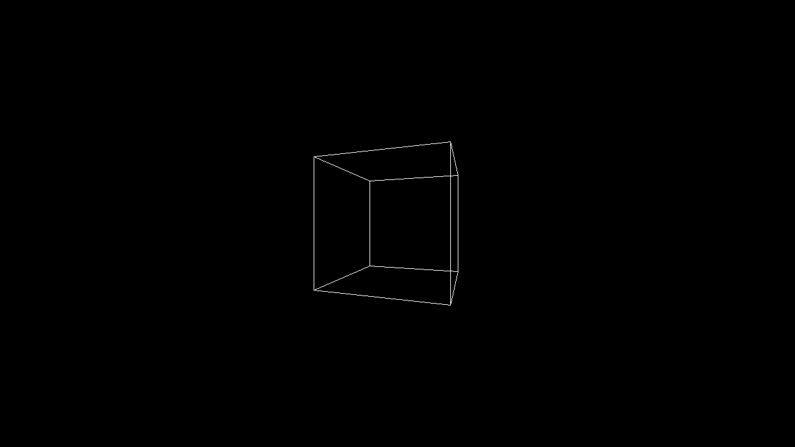

# Grafica 3D, implementata pe FPGA
**Randare 3D în timp real implementată hardware pe FPGA (Verilog).**

## Descriere proiect
Acest proiect implementează un pipeline grafic 3D hardware nativ, optimizat pentru arhitecturi FPGA (testat pe seria Xilinx Zynq-7000 / xc7z010). Sistemul transformă modelele 3D în pixeli afișabili în timp real, utilizând exclusiv aritmetică în virgulă fixă (format Q) semnată, pentru un consum minim de resurse hardware și latență ultra-scăzută.

Arhitectura modulară separă clar etapele de transformare geometrică, rasterizare și control al memoriei, permițând paralelizarea fluxului de date și un control complet determinist.

---

## Progrese recente

- **Timing Closure la 74.25 MHz:** Sistemul îndeplinește constrângerile de timing pentru rezoluția HD (1280x720p @ 60FPS). Frecvența a fost atinsă prin optimizarea modulelor de multiplicare DSP și aplicarea strategiilor de *Performance_Retiming* în Vivado.
- **Optimizare inițială a pinout-ului:** S-a reușit o primă restrângere a porturilor I/O externe de la aproximativ 360 de pini la 222. Arhitectura este în curs de revizuire pentru a reduce în continuare acest număr.
- **Hardware Interlocking (WIP):** Logica de arbitraj și secvențiere a datelor este integrată parțial în `master_controller` pentru a menține modulul `top_graphics` pur structural și a proteja memoria bufferelor (BRAM) împotriva coruperii datelor în timpul stărilor de *busy*.

De asemenea, pentru a valida corectitudinea matematică a pipeline-ului grafic înainte de sinteza fizică, testbench-ul principal extrage periodic conținutul bit-packed din Framebuffer și generează automat un fișier imagine standardizat în format bitmap (`.bmp`). 

Această metodă confirmă funcționarea corectă a procesorului de vertecși, a proiecției de perspectivă și a rasterizatorului Bresenham:

*Fig 1. Vizualizarea wireframe a modelului 3D, obținută prin conversia directă a dump-ului de memorie din Framebuffer în format .bmp*

---

## Arhitectura Sistemului

### 1. Primitive Aritmetice Custom (Format Q)
Toate modulele suportă lungime de bit parametrizabilă și includ logică dedicată pentru gestionarea limitelor numerice:
* **Q-Adder/Subtractor:** Implementare cu saturare hardware și semnalizare pentru overflow/underflow.
* **Q-Multiplier:** Gestionare automată a alinierii punctului fix după efectuarea produsului (mapare eficientă pe blocurile DSP48E1).
* **Q-Divider:** Implementare secvențială, bazată pe o mașină de stări (FSM) pentru economisirea resurselor logice (LUTs).

### 2. Pipeline Geometric (Vertex Processing)
* **Rotation Unit:** Aplică rotații 3D (Pitch, Yaw, Roll) folosind funcții trigonometrice precalculate și optimizate.
* **Projection Unit:** Execută transformarea de perspectivă (împărțirea la Z) bazată pe FSM.
* **NDC to Screen:** Mapează coordonatele din spațiul normalizat (NDC) pe rezoluția fizică a framebuffer-ului.
* **Vertex Processor (Top Level):** Orchestrează modulele de mai sus într-un flux de tip pipeline continuu.

### 3. Arhitectura de Memorie
* **Vertex Buffer:** Stochează vertecșii transformați și proiectați.
* **Edge Buffer:** Definește topologia (conexiunile dintre vertecși) pentru etapa de rasterizare.
* **Point Buffer:** Reține punctele intermediare ale pipeline-ului.
* **Framebuffer:** Memorie video compactată (bit-packed, 32 pixeli per cuvânt de memorie) pentru stocarea imaginii finale.

### 4. Rasterizare
* **Bresenham Line Generator:** Implementare hardware a algoritmului Bresenham. Unitate FSM complet deterministă care generează incremental pixelii segmentelor de dreaptă și îi scrie direct în Framebuffer.

### 5. Control și Sincronizare
* **Master Controller:** Creierul sistemului. Gestionează FSM-ul global, arbitrează accesul între procesor (PS) și FPGA (PL), sincronizează Vertex Processor-ul cu Rasterizer-ul și gestionează semnalele de control (busy, frame_done).
* **Top Graphics:** Wrapper structural curat care interconectează toate blocurile IP interne și expune magistralele externe.

---

## Validare și Testbench-uri

Fiecare modul a fost verificat independent prin simulări exhaustive (**Random Testing**):
* **Golden Model Comparison:** Rezultatele hardware (DUT) sunt comparate ciclu cu ciclu cu un model matematic ideal scris în Verilog comportamental.
* **Analiza Erorilor (Precision Loss):** Sistemul monitorizează și loghează automat deviațiile (delta) dintre reprezentarea hardware în virgulă fixă și rezultatele teoretice în virgulă mobilă.
* **Reproductibilitate:** Utilizarea de (`seed-uri`) fixe pentru testele bazate pe `$urandom` asigură reproductibilitatea edge-case-urilor.
* *(Mulțumiri: Modulul de utilitare `clk_rst_tb` utilizat pentru generarea mediului de test a fost preluat de la Prof. Dr. Ing. Dan Nicula).*

---

## Roadmap / TODO

- [ ] **Compactare I/O Top Level:** Multiplexarea magistralelor de date și mutarea logicii de control I/O în `master_controller` pentru a permite implementarea fizică (Zynq PS-PL interface prep).
- [ ] **Data Safety:** Implementarea detecției și tratării complete a cazurilor de **Underflow** pe tot lanțul aritmetic.
- [ ] **Z-Clipping (Clip Space):** Adăugarea parametrilor de clampare (planul NEAR și planul FAR) pentru a evita artefactele vizuale cauzate de valorile extreme pe axa Z.
- [ ] **HDMI/VGA Video Controller:** Dezvoltarea unui modul hardware pentru generarea semnalelor video sincrone, citirea Framebuffer-ului pe o interfață dedicată de read-only și output serial (TMDS/OSERDES).
- [ ] **Interfață AXI4-Lite Slave:** Împachetarea întregului pipeline într-un IP custom cu interfață AXI pentru conectarea facilă la procesorul ARM (Zynq PS) – va permite încărcarea de modele `.obj` din C/C++ (Software).
- [ ] **Documentație Completă:** Redactarea diagramelor de arhitectură (Block Designs), detalierea FSM-urilor și documentarea formatului Q ales.

---

**Autor:** Petru-Andrei BRASOVEANU 
**Instituție:** Universitatea Transilvania din Brașov
**An:** 2026 
**Tehnologii:** Verilog 2001/SystemVerilog, Xilinx Vivado, FPGA (Zynq-7000), Fixed-Point DSP

